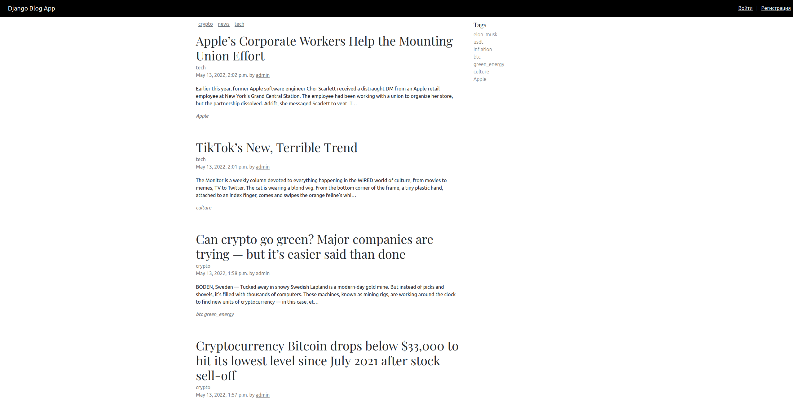

Simple Django Blog App.

Supports authentication, tags, categories, adding and viewing posts.

## Installation
```
python3 -m venv .env
source .env/bin/activate
pip install -r requirements.txt 
```

## Run
```
cd django_blog_app/
python manage.py createsuperuser
python manage.py makemigrations
python manage.py migrate
python manage.py runserver
```

